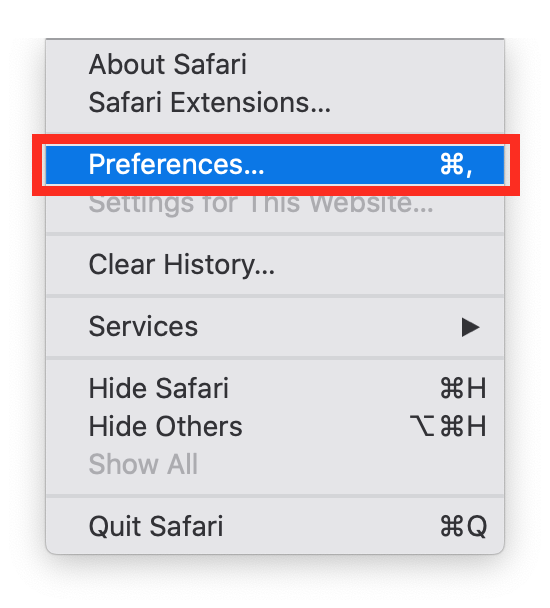
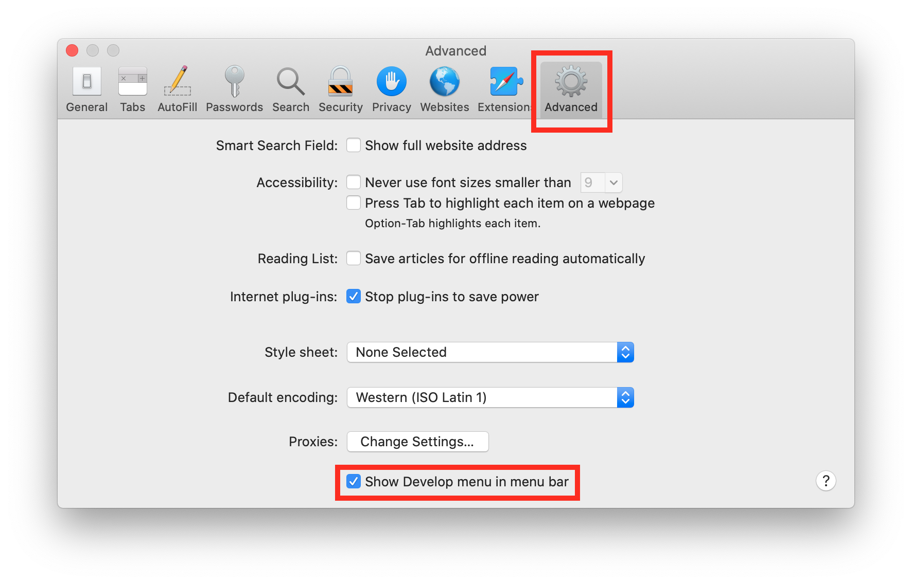
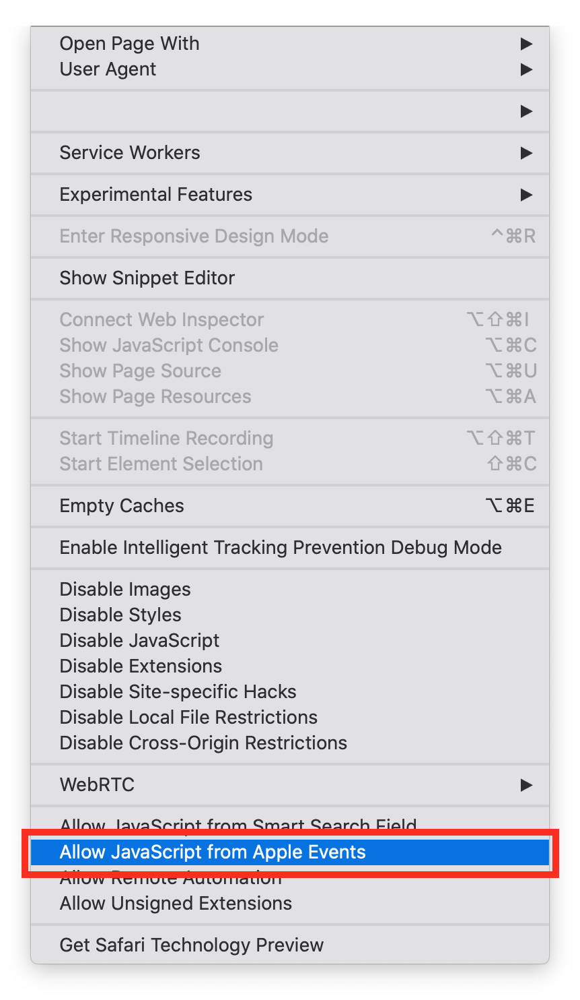
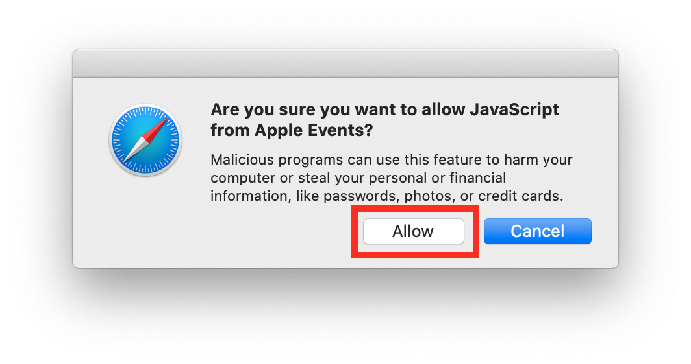
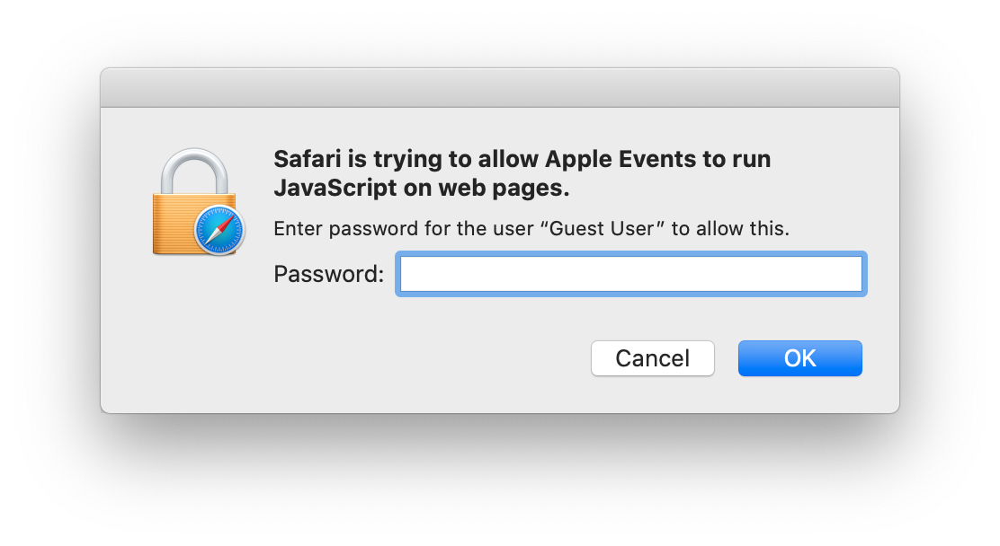

# Allow WSTC to use JavaScript in Safari

The script uses JavaScript to enter your login information and to get required information from the webpages.
This brief guide will show you how to allow this.

### Open Safari Preferences
Open Preferences how you usally do (either `CMD+,` or "Preferences…" from the Safari menu).
 

### Turn on the Develop menu
In Preferences, navigate to the "Advanced" tab and enable "Show Develop menu in menu bar".
 

### Turn on JavaScript from Apple Events
Click on the Develop menu that has now appeared in the menubar, then select "Allow JavaScript from Apple Events" near the bottom of the menu.
 

### Confirm your selection
Safari will ask you to confirm that you want to allow the script to use JavaScript in Safari.
Click "Allow".
 

### Enter your user password
Safari will ask you to enter your user account password.
Enter your password and click "OK".
 

### Turn off the Develop menu
If desired, return to Safari Preferences and disable the Develop menu.
It is not necessary to keep the menu enabled.
